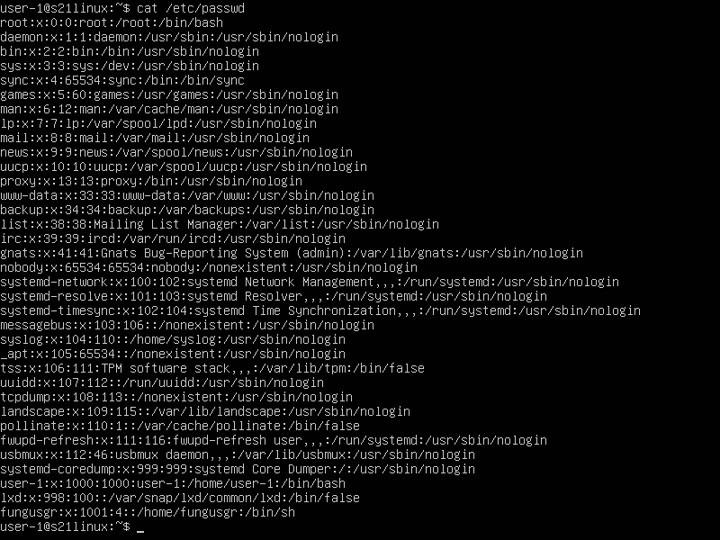
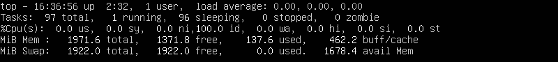
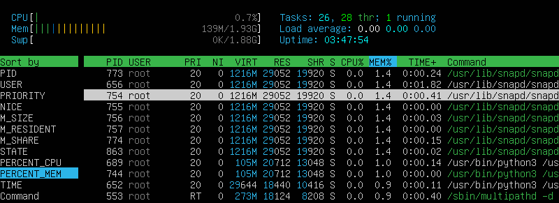
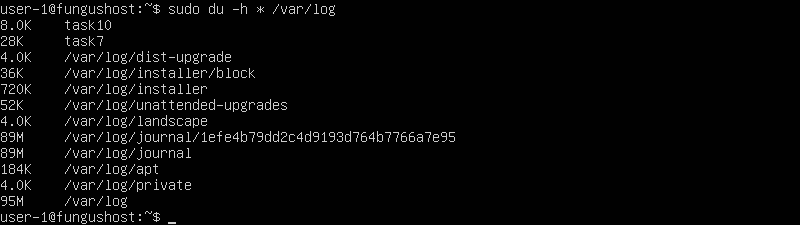

  

## Содержание D01_Linux-1
\
    1 [Установка ОС](#part-1-установка-ос)  
    2 [Создание пользователя](#part-2-создание-пользователя)  
    3 [Настройка сети ОС](#part-3-настройка-сети-ос)   
    4 [Обновление ОС](#part-4-обновление-ос)  
    5 [Использование команды  sudo](#part-5-использование-команды-sudo)  
    6 [Установка и настройка службы времени](#part-6-установка-и-настройка-службы-времени)  
    7 [Установка и использование текстовых редакторов](#part-7-установка-и-использование-текстовых-редакторов)  
    8 [Установка и базовая настройка сервиса SSHD](#part-8-установка-и-базовая-настройка-сервиса-sshd)   
    9 [Установка и использование утилит top, htop](#part-9-установка-и-использование-утилит-top-htop)   
    10 [Использование утилиты fdisk](#part-10-использование-утилиты-fdisk)   
    11 [Использование утилиты df](#part-11-использование-утилиты-df)    
    12 [Использование утилиты du](#part-12-использование-утилиты-du)    
    13 [Установка и использование утилиты ncdu](#part-13-установка-и-использование-утилиты-ncdu)    
    14 [Работа с системными журналами](#part-14-работа-с-системными-журналами)     
    15 [Использование планировщика заданий CRON](#part-15-использование-планировщика-заданий-cron)    

## Реализованные требования к проекту `D01_Linux-1`

В качестве результата работы предоставлен отчет по выполненным задачам:  
- В репозиторий, в папку src, загружен отчёт - файл `README.md`  
- Отчёт оформлен в виде списка  
- Каждый скриншот в отчёте подписан    
- Все части задания в отчёте, выделены заголовками 2-го уровня  
- Все скриншоты обрезаны так, чтобы была видна только нужная часть экрана  

## Part 1. Установка ОС

  
Развернуть/Свернуть отчёт

  

Установлена ОС [Ubuntu Server 20.04 LTS](https://ubuntu.com/download/server) без графического интерфейса с помощью [VirtualBox](https://skillbox.ru/media/code/kak-ustanovit-virtualbox-i-zapustit-svoyu-pervuyu-virtualnuyu-mashinu/)  

С помощью команды `cat /etc/issue` узнаем актуальную версию установленной ОС

## Part 2. Создание пользователя

  
Развернуть/Свернуть отчёт

Создан новый пользователь `fungusgr` и добавлен в группу `adm` командой `sudo useradd -g adm fungusgr`  

С помощью команды `cat /etc/passwd` выводим информацию о новом пользователе

## Part 3. Настройка сети ОС

  
Развернуть/Свернуть отчёт

Задал название машины вида user-1 командой `sudo hostnamectl set-hostname user-1`  
Проверил, что содержимое hostname сохранилось командой `cat /etc/hostname`  

Установил временную зону, соответствующую моему текущему местоположению командой `sudo timedatectl set-timezone Europe/Moscow`  
Проверил, что время установилось верно командой `timedatectl`  

Вывел названия сетевых интерфейсов с помощью консольной команды `ip_a`  

> ### Для чего нужен интерфейс lo?  
> Интерфейс [lo](https://ru.wikipedia.org/wiki/Loopback) (Loopback) используется для тестирования сетевого соединения на компьютере.  
> Он позволяет устройству отправлять и принимать данные, которые затем обрабатываются локально, а не отправляются по реальной сети.  
> Этот интерфейс часто используется для проверки сетевых настроек и программ без необходимости использования реальных сетевых соединений.   
> Обычно lo имеет IP-адрес 127.0.0.1  

Используя команду `sudo dhclient -v enp0s3` получил ip адрес устройства от DHCP сервера  

  

[Памятка по dhclient](https://translated.turbopages.org/proxy_u/en-ru.ru.d964b29b-659f2480-418e0a13-74722d776562/https/www.computerhope.com/unix/dhclient.htm)  

> ### Что такое DHCP?
> [DHCP](https://ru.wikipedia.org/wiki/DHCP) (Dynamic Host Configuration Protocol) - протокол динамической настройки узла. 
> - автоматически назначает IP-адреса устройствам в сети    
> - упрощает процесс настройки устройств, подключаемых к сети  
> - упрощает администрирование сети  
> - DHCP-сервер управляет базой IP-адресов и предоставляет их клиентам в ответ на запрос   
> - может предоставлять другую информацию устройствам в сети, такую как адрес DNS-сервера или адрес шлюза по умолчанию   
> - позволяет добавлять или удалять устройства из сети без необходимости вручную изменять настройки   
> - может помочь сохранить IP-адреса, повторно используя адреса, которые больше не используются   
> - позволяет упростить диагностику подключения и переход из одной подсети в другую, через уведомления в логах    
>  
>  

Вывел на экран внутренний IP-адрес шлюза, он же ip-адрес по умолчанию (gw) командой `ip route | grep default | awk '{print $3}'`  

 

Вывел на экран внешний ip-адрес шлюза (ip) командой curl `ifconfig.me`    

  

Задал статичные настройки для ip, gw и dns, редактируя файл командой `vim /etc/netplan/00-installer-config.yaml`   

  

Применил изменения командой `sudo netplan apply` 

  

Перезагрузил виртуальную машину командой `reboot`   
Проверил, что всё ок командой `ip a | grep 'global enp0s3' && ip route show | grep '192.168.2.0' && resolvectl status | grep -E '(1\.1\.1\.1|8\.8\.8\.8)'`  

  

Успешно пропинговал `ping 1.1.1.1` и `ping ya.ru`  
Выделил на скриншоте *0% packet loss»*  

  

## Part 4. Обновление ОС

  
Развернуть/Свернуть отчёт

Обновил системные пакеты до последней версии командами `sudo apt update` и `sudo apt upgrade`     

   
   

После обновления системных пакетов, если ввести команду обновления повторно, видно, что обновления отсутствуют  

## Part 5. Использование команды **sudo**

  
Развернуть/Свернуть отчёт

> Команда sudo позволяет пользователям запускать программы от имени суперпользователя   
> 

Разрешил пользователю, созданному в [Part 2](#part-2-создание-пользователя), выполнять команду sudo.  
Для разрешения пользователю *fungusgr* использовать команду "sudo" добавляем его в файл конфигурации sudoers командой `sudo adduser fungusgr sudo`  

Изменил hostname ОС от имени пользователя *fungusgr*, созданного в пункте [Part 2](#part-2-создание-пользователя) с *user-1 на fungushost* используя sudo    
Для изменения имени хоста от имени юзера *fungusgr*, нужно сначала переключиться на эту учётку  
Для этого сначала задаём пароль для учётки командой `sudo passwd fungusgr`  
Захожу под пользователем *fungusgr* и проверяю командой `whoami`  
Меняю имя хоста командой `sudo hostnamectl set-hostname fungushost`  

  

Проверяю с другой учётки    

## Part 6. Установка и настройка службы времени

  
Развернуть/Свернуть отчёт

Настроил службу автоматической синхронизации времени командой `sudo timedatectl set-ntp 1`    
Вывел время часового пояса командой `timedatectl show`  
Выделил в выводе `NTPSynchronized=yes`    

## Part 7. Установка и использование текстовых редакторов 

  
Развернуть/Свернуть отчёт

Установил текстовый редактор MCEDIT командой `sudo apt install mcedit`  
VIM и NANO в этой версии Ubuntu идут в коробке  

### VIM Test  
Используя редактор *VIM* создал файл командой `vim test_VIM.txt`  
Написал в нём свой никнейм, заскринил и закрыл с сохранением изменений    

  
  

Заменил никнейм на строку «21 School 21», заскринил и закрыл без сохранения изменений  

  
  

Использовал команду для поиска слова, заскринил  

  
  

Использовал команду для замены fungusgr на s21_fungusgr, заскринил  

  
  

 
| 		 Функция	    | 			        Команда VIM			          |
| --------------------- | ----------------------------------------------- |
| Режим редактирования: | 						i                         |
| Выход с сохранением:  | 					esc+shift+zz  				  |
| Выход без сохранения: | 					esc+shift+zq    			  |
| Поиск:                | 			/<текст, который хотим найти>  		  |
| Замена:               | :s/<что хотим изменить>/<на что хотим заменить> |

### NANO Test  
Используя редактор *NANO* создал файл командой `nano test_NANO.txt`  
Написал в нём свой никнейм, заскринил и закрыл с сохранением изменений    

  
   

Использовал команду для поиска слова, заскринил  

  
  

Использовал команду для замены fungusgr на строку «21 School 21», заскринил и закрыл без сохранения изменений  

  
  
  
  
  
  

| 		 Функция	    | 			       Команда NANO			          |
| --------------------- | ----------------------------------------------- |
| Выход с сохранением:  |        Ctrl+O, затем Enter, затем Ctrl+X  	  |
| Выход без сохранения: | 	              Ctrl+X, затем N    			  |
| Поиск:                | 			Ctrl+W, затем слово и Enter  		  |
| Замена:               | Alt+R, искомое слово, Enter, новое слово, Enter |

### MCEDIT Test  
Используя редактор *MCEDIT* создал файл командой `mcedit test_MCEDIT.txt`  
Написал в нём свой никнейм, заскринил и закрыл с сохранением изменений    

  
   

Использовал команду для поиска слова, заскринил  

  

Использовал команду для замены fungusgr на строку «21 School 21», заскринил и закрыл без сохранения изменений  

  
  
  

| 		 Функция	    | 			        Команда	MCEDIT		          |
| --------------------- | ----------------------------------------------- |
| Выход с сохранением:  |          		    Esc, затем Yes 	  			  |
| Выход без сохранения: | 	              	Esc, затем No    			  |
| Поиск:                | 			   F7, затем слово и Enter  		  |
| Замена:               | 			   F4, затем слово и Enter 			  |

## Part 8. Установка и базовая настройка сервиса **SSHD**

  
Развернуть/Свернуть отчёт

Установил службу [SSHd](https://redos.red-soft.ru/base/manual/redos-manual/safe-redos/sshd-openssh/) командой `sudo apt-get install openssh-server`  
Добавил автостарт службы при загрузке системы командой `sudo update-rc.d ssh defaults`  
Перенастроил службу SSHd на порт 2022 командой для редактирования файла конфигурации `sudo sed -i 's|^#Port 22$|Port 2022|' /etc/ssh/sshd_config`    
Проверил порт командой `sudo grep "^Port" /etc/ssh/sshd_config`  
Перезапустил службу SSHd командой `sudo service ssh restart`  
Проверил статус службы командой `sudo systemctl status ssh`  

  

Используя команду `ps -e | grep sshd` вывел процесс *sshd*  

  

> `ps` выводит информацию о запущенных процессах в виде таблицы   
> Использованные ключи команды `ps`:  
> `-e`: выводит список всех процессов, включая процессы, не связанные с терминалом     
> 

Перезагрузил систему командой `reboot`   

Установил netstat командой `sudo apt-get install net-tools`  

  

> `netstat` показывает информацию о сетевых соединениях, маршрутизации и статистике сетевых протоколов  
> Использованные ключи команды `netstat`:  
> `-t`: Показывает активные TCP-соединения  
> `-a`: Показывает всех активных подключений TCP и UDP, включая прослушиваемые порты  
> `-n`: Отображает активные подключения TCP с числовыми значениями для адресов и портов вместо имени хоста  
> 

Скрин с выводом команды `netstat -tan | grep 2022`  

  

> комментарии к скриншоту выше:  
> "tcp" - указывает на использование протокола TCP  
> "tcp6" - указывает на использование протокола TCP с IPv4, и  IPv6  
> "0.0.0.0:2022" - адрес и порт, на котором слушает сервер    
> "LISTEN" - состояние порта, в данном случае, служба ждет входящих соединений  
> "0.0.0.0:*" - обозначает, что сервер принимает соединения на любом доступном интерфейсе для указанного порта 

## Part 9. Установка и использование утилит **top**, **htop**

  
Развернуть/Свернуть отчёт

Утилиты [top](https://losst.pro/komanda-top-v-linux?liveurl=1) и htop уже были в коробке, но если бы их не было, я бы воспользовался командами:    
 - `sudo apt-get update`  
 - `sudo apt-get install htop`  

В шапке вывода `top` видна основная информация об окружении:  

  

> в строке, с ...  
> "up" мы видим uptime: 2 часа 32 минуты  
> "user", это количество авторизованных пользователей: 1    
> "load average" видна общая загрузка системы: 0,00   
> "Tasks XX total" можно увидеть общее количество процессов: 97    
> "Cpu(s)" загрузка cpu: в нашем случае ожидание 100%  
> 
> | Загрузка памяти       |     MiB Mem, MiB	 |   MiB Swap, MiB   |
> | --------------------- | -------------------- | ----------------- |
> | общий объем:          |         1971.6       |      1922.0       |
> | свободно:             | 	    1371.8       | 	    1922.0       |
> | занято:               | 	    137.6        | 	     0.0         |
> | зарезервировано:      | 	    462.2        | 	     N/A         |
> | доступно:             |          N/A 		 |      1678.4 		 |
>  
> pid процесса занимающего больше всего памяти командой `top -o %MEM`    
> 
>   
> 
> pid процесса, занимающего больше всего процессорного времени командой `top -o %CPU`  
> 
>   
> 

Cкрины с выводом команды htop, отсортированному по PID, PERCENT_CPU, PERCENT_MEM, TIME (F6)  

  
  
  
  

Фильтр по процессу *sshd* (F4)  

  

Процесс syslog, найденный, через поиск (F3)  

  

Добавил в шапку вывод hostname, clock и uptime (F2)  

## Part 10. Использование утилиты **fdisk**

  
Развернуть/Свернуть отчёт

Запустил команду [fdisk](https://losst.pro/komanda-fdisk-v-linux) -l и вывел данные по накопителю    

  

Проверил размер подкачки [swap](https://losst.pro/nastrojka-swap-v-ubuntu-16-04) командами `swapon --show` и `free -h`  

> Использованные ключи команды `fdisk`:  
> `-l` или `--list`: выводит данные по всем разделам на всех устройствах  
> 

## Part 11. Использование утилиты **df** 

  
Развернуть/Свернуть отчёт

Запустил команду [df](https://losst.pro/komanda-df-linux)  

  

> Данные корневого раздела (/):  
> - размер раздела: 10218772 Kb  
> - размер занятого пространства: 5691700 Kb  
> - размер свободного пространства: 3986400 Kb  
> - процент использования: 59    
> 

Запустил команду `df -Th`  

  

> Данные корневого раздела (/):  
> - размер раздела: 9.8 Gb  
> - размер занятого пространства: 5.5 Gb  
> - размер свободного пространства: 3.9 Gb  
> - процент использования: 59  
> - тип файловой системы: ext4   
>  

> ext4 - это одна из наиболее распространенных расширенных файловых систем 4-го поколения для Linux    
> Она поддерживает большие объемы файлов и размеров дисков, журналируется для обеспечения целостности данных и обладает хорошей производительностью  
> 

> Использованные ключи команды `df`: 
> `-t`, `-T` или `--type`: выводит информацию только про указанные файловые системы  
> `-h`: выводит размер файлов в человекочитаемом виде  
> 

## Part 12. Использование утилиты **du**

  
Развернуть/Свернуть отчёт

Запустил команду [du](https://losst.pro/komanda-du-v-linux) и заскринил вывод   

  

Вывел размер папок */home, /var, /var/log* в байтах и в человекочитаемом виде  

  
  

Вывел размер каждого вложенного элемента, используя `*` в */var/log*    

  

> Использованные ключи команды `du`:      
> `-s` или `--summarize`: выводит только общий размер папок  
> `-h` или `--human-readable`: выводит размер файлов в человекочитаемом виде  
> 

## Part 13. Установка и использование утилиты **ncdu**

  
Развернуть/Свернуть отчёт

Установил утилиту [ncdu](https://zalinux.ru/?p=3011) командой `sudo apt get install ncdu`   

  

Вывел и заскринил размер папок:   

/home  
  
  

/var  
  
  

/var/log  
  

Размеры +/- совпадают с полученными в [Part 12](#part-12-использование-утилиты-du)

## Part 14. Работа с системными журналами

  
Развернуть/Свернуть отчёт

[Как работать с логами в Linux](https://losst.pro/kak-posmotret-logi-v-linux)  

Открыл для просмотра:
1. /var/log/syslog `less /var/log/syslog`  
2. /var/log/auth.log `less /var/log/auth.log`   
3. /var/log/dmesg командой `less /var/log/dmesg`  

> Использовал [less](https://losst.pro/komanda-less-v-linux) для открытия в режиме прокрутки  
> 

В файле *auth.log* нашёл информацию о времени последней успешной авторизации, имени пользователя и методе входа в систему  

  

> [PAM](https://losst.pro/nastrojka-pam-v-linux?liveurl=1) (Pluggable Authentication Modules) - это механизм аутентификации в Unix-подобных операционных системах.  
> Одним из ключевых преимуществ PAM является его гибкость и возможность настройки через конфигурационные файлы, что делает его удобным для интеграции с различными приложениями и системами аутентификации. 
> PAM также позволяет централизованно управлять политиками безопасности и аутентификации на системе.  
> 

Перезапустил службу SSHd командой `sudo service ssh restart`  
Вставил скрин с сообщением о рестарте службы sshd   

  

> Для [просмотра логов](https://serverfault.com/questions/130482/how-to-check-sshd-log) sshd:  
> `journalctl -t sshd`: все сообщения о sshd  
> `journalctl -t sshd -b0`: cообщения о последней загрузке
> 

## Part 15. Использование планировщика заданий **CRON**

  
Развернуть/Свернуть отчёт

> Cron - это утилита командной строки, используемая в Unix-подобных системах для планирования выполнения задач по расписанию. Название "cron" происходит от греческого слова "Chronos", означающего время.  
> 
> Пользователи, настраивающие и поддерживающие программные среды, используют cron для запланированного выполнения команд или скриптов на определенном расписании.  
> 
> Действия cron определяются в файле crontab, который является конфигурационным файлом, указывающим команды оболочки для периодического выполнения в соответствии с заданным расписанием. Каждый пользователь может иметь собственный файл crontab, а также существует системный файл crontab для заданий, выполняемых от имени всей системы.  

Запустил вызов uptime каждые 2 минуты командой `crontab -e`, добавил строку `*/2 * * * * uptime`   

  

Проверил статус службы командой `systemctl status cron`

   

Нашёл в системных журналах четыре строчки о выполнении командой `journalctl -u cron`   

  

> journalctl - это утилита в системе systemd, предназначенная для просмотра и анализа журналов системы.   
Она предоставляет возможности фильтрации, поиска и просмотра журналов всех служб и событий systemd.      
> 

Вывел на экран список текущих заданий для CRON командой `crontab -l`  
Удалил все задания из планировщика заданий командой `crontab -r`  
Убедился, что список заданий удалён  

  

> Использованные ключи команды `crontab`:   
> `-e`: редактировать таблицу задач     
> `-r`: удалить таблицу задач  
> `-l`: показать таблицу задач    
> 

> Использованные ключи команды `journalctl`:   
> `-u` или `--unit`: - показать сообщения от выбранного сервиса      
> 

> Не придумал ничего лучше, чем оставить сслыки на прочитанное для выполнения задания тут:  
> [Что такое Cron и зачем нужен](https://timeweb.com/ru/community/articles/chto-takoe-cron)   
> [Автоматизация задач с помощью cron](https://timeweb.cloud/tutorials/ubuntu/avtomatizaciya-zadach-s-pomoshchyu-cron-v-ubuntu-18-04?ysclid=lrd0wd7hje842263581)  
> [Настройка cron](https://losst.pro/nastrojka-cron?ysclid=lrd0w7nq6o268107227)   
> [Шпаргалка по journalctl в Linux](https://losst.pro/shpargalka-po-journalctl-v-linux)  

